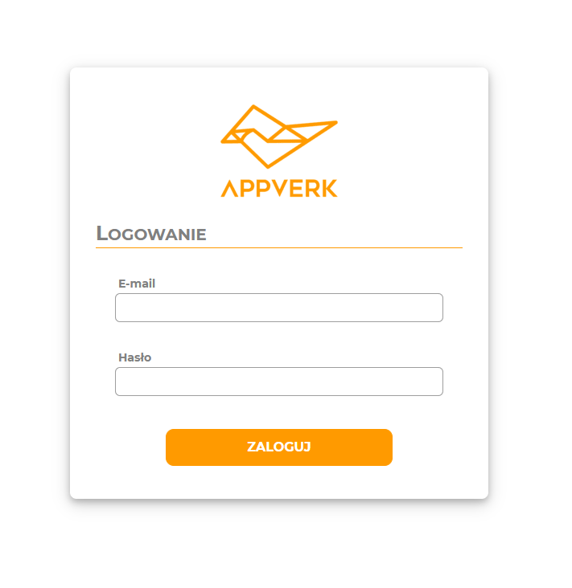

# Zadanie rekrutacyjne: AppVerk

<i> Sebastian Koczotowski - Frontend Developer </i>

## Development server

To start a local development server, run:

```bash
ng serve
```

## Running unit tests

To execute unit tests with the [Karma](https://karma-runner.github.io) test runner, use the following command:

```bash
ng test
```

## App preview:


